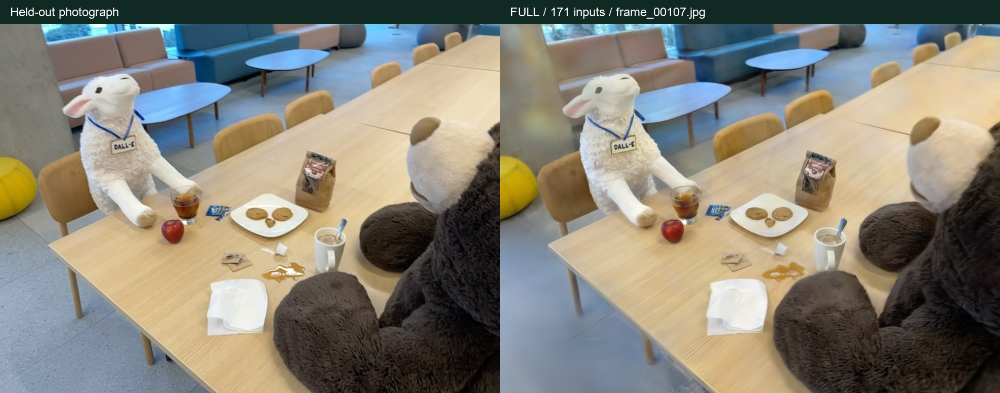
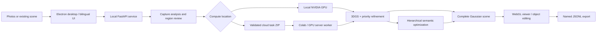

<div align="center">

# Splat Studio

### From photos to an editable 3D scene

A bilingual desktop workbench that brings **3D Gaussian reconstruction, sparse-view geometry, hierarchical semantics, and object-focused refinement** into one guided workflow.

**English** · [简体中文](README.zh-CN.md) · [Complete user guide](docs/user-guide.html) · [Colab notebook](colab/Splat-Studio-User-Guide.ipynb) · [Fine showcase](docs/fine-evaluation/README.md)



</div>

## See the app in action

[**Explore the bilingual Fine measurements and workflow screenshots →**](docs/fine-evaluation/README.md)

Actual **22,000-step A100** runs reconstruct Teatime from **171 photos** and from **six sparse photos with learned visible-geometry completion**. The showcase pairs held-out image comparisons with overall rendering, priority-object and semantic metrics, including a same-test-view comparison.

[Whole-project report](docs/fine-evaluation/项目报告.html) · [All measurements](docs/fine-evaluation/精度评测.html) · [Earlier Fast native interaction walkthrough](docs/demo/README.md).

**Overall PSNR 26.08 dB · coffee mug ROI SSIM 0.921 · stuffed bear IoU 94.2%**

Overall PSNR uses 6 held-out views; the priority detail averages 5 annotated views of coffee mug, selected by mean ROI SSIM among the two priority categories. The semantic highlight is the best pooled class with at least two annotated views (171-input run, 5 evaluated views); all classes and coverage remain in the report.

## A complete workflow, from capture to interaction

Splat Studio connects the practical steps between a set of photographs and an interactive scene: checking the capture, selecting a reconstruction strategy, preparing GPU tasks, reviewing important objects, training, and opening the result in a desktop editor.

Start with **Reconstruct from photos** or **Import a reconstruction**. The interface explains the next decision and reveals sparse-view options after examining the photos. A persistent **中文 / EN** switch changes the interface in place while preserving the scene, inputs, and selected settings.

| What you can do | How it works |
| --- | --- |
| **Reconstruct your own photos** | Name a scene, add photos, review overlap and duplicate checks, then choose quality and a computing device. Camera poses are recovered during reconstruction. |
| **Handle sparse captures** | Route sparse or weakly connected inputs through geometric validation, with DUSt3R initialization and visible-region completion when appropriate. |
| **Spend detail where it matters** | Enter priority objects, review their actual pixel masks, and use weighted RGB optimization, higher-resolution refinement, and bounded densification. |
| **Build consistent scene semantics** | Associate masks across views, maintain object/part hierarchy, and optimize per-Gaussian semantic probabilities with confidence-weighted supervision. |
| **Work locally or with a cloud GPU** | Run on a configured local NVIDIA environment, or exchange validated task packages with Colab, Linux/Windows servers, WSL2, or GPU containers. |
| **Explore and edit** | Rotate, pan, zoom, search, focus, isolate, hide, and undo. Use hierarchy selection or local natural-language commands, with an optional configured LLM. |
| **Keep the full scene** | Load all input Gaussians and SH coefficients through degree 3. Filter distant background around the scene or selected objects without discarding source data. |
| **Save and reopen** | Export a named, streaming `.splat.jsonl` scene with geometry, semantics when present, and display state. Import complete scenes or matched PLY + semantic packages. |

## Try it

1. Open the desktop app and choose **Reconstruct from photos**.
2. Name the scene and select overlapping photographs of a static subject.
3. Confirm the photo-based recommendation. Choose **Appearance only** or **Identify objects too**.
4. For important objects, enter names and confirm their detected regions across photos.
5. Choose **Fast**, **Balanced**, or **Fine**, then a local or cloud NVIDIA GPU.
6. Run the reconstruction, import the completed result if using cloud execution, and explore it.
7. Save as **`your-scene-name.splat.jsonl`** and reopen it later.

The [bilingual user guide](docs/user-guide.html) includes the full recognition → confirmation → training → import loop, manual annotation, setup commands for each environment, and troubleshooting. Download the HTML and open it in a browser to use its language switch. The notebook can be uploaded directly to Colab.

## Reconstruction and semantic methods

### Photo-grounded sparse geometry

Photo ingestion normalizes EXIF orientation and records image identity. Capture analysis combines duplicate detection, feature matching, overlap connectivity, and optional known coverage. The geometry stage prefers verified SfM and checks camera registration, reprojection, and parallax. For sparse captures, a pinned **DUSt3R** model supplies learned visible geometry, with alignment and consistency checks before points are accepted. Point provenance is retained for observed/inferred/unknown visualization.

Implementation: [`planning.py`](backend/planning.py), [`capture.py`](backend/capture.py), [`sparse_geometry.py`](backend/sparse_geometry.py), [`learned_geometry.py`](backend/learned_geometry.py).

### Important objects receive a real training budget

Priority text is resolved to candidate object labels. The user reviews the corresponding image regions before training, including objects touching image boundaries. Confirmed masks increase RGB error weight in the selected regions; a final refinement stage uses higher-resolution images and a bounded densification budget. Gaussian lineage keeps semantic identity aligned as the point set changes. The result can include matched before/after renders and region metrics for inspection in the app.

Implementation: [`priority_workflow.py`](backend/priority_workflow.py), [`priority_detail.py`](backend/priority_detail.py), [`gaussian_lineage.py`](backend/gaussian_lineage.py), [`upstream.py`](backend/upstream.py).

### Hierarchy and confidence across views

The semantic pipeline combines **Grounding DINO + SAM** masks, manual object/part annotations, and an importer for **LaGa-format multilevel region/descriptor arrays**. Geometry-based association links regions across views and builds descriptor groups and supported parent/child relationships.

After RGB reconstruction, geometry is frozen while independent per-Gaussian semantic probabilities are optimized through the differentiable Gaussian renderer. The improved objective combines balanced BCE, Dice, boundary uncertainty weights, cross-view confidence, hierarchy consistency, and a high-confidence prior. Missing detections remain unknown rather than becoming negative labels. The training-view schedule scales with the chosen mode and covers valid supervision pairs.

Implementation: [`semantic_granularity.py`](backend/semantic_granularity.py), [`semantic_refinement.py`](backend/semantic_refinement.py), [`semantic_service.py`](backend/semantic_service.py), [`import_laga_regions.py`](scripts/import_laga_regions.py).

### Complete Gaussian rendering and reversible editing

The Three.js/WebGL viewer evaluates the SH coefficients present in the source, supports streaming scene transport, and separates **loaded count** from **currently visible count**. Core-region controls remove distant clutter from the current view. Object selection, hierarchical visibility, isolation, and undo operate on retained scene data. Native export streams to a temporary file and commits the destination only after the complete scene is written.

Implementation: [`viewer.js`](frontend/viewer.js), [`gaussian_sh.js`](frontend/gaussian_sh.js), [`core_region.js`](frontend/core_region.js), [`scene_transport.js`](frontend/scene_transport.js), [`scene-export.cjs`](desktop/scene-export.cjs).

## Quality profiles

| Profile | RGB steps | Base image scale | Semantic view budget | Base semantic steps | Priority refinement, within RGB total |
| --- | ---: | --- | --- | ---: | ---: |
| Fast | 7,000 | ¼ width / height | Up to 12 | 400 | 400 |
| Balanced | 15,000 | ½ width / height | Up to 24 | 1,200 | 1,200 |
| Fine | 22,000 | Original | All training views | 2,400 | 2,400 |

**Hierarchy processing and cross-view confidence are used in every profile.** Semantic steps may increase to cover valid view/class pairs. The app estimates compute time from the selected device and budget, and can incorporate a measured training rate. Local training progress reports a rolling ETA for the active training loop.

## Architecture



The native app starts a loopback-only backend and authenticates requests with a per-session token. Cloud exchange packages carry image identities, configuration and integrity checks; the worker validates them before execution. API credentials stay in environment variables and are not automatically exported with tasks.

## Develop and run

Use Node.js 22 and standard Python 3.12. Run the following from the repository root:

```bash
git clone https://github.com/Xuyw041006-arch/splat-studio.git
cd splat-studio
python3 -m venv .venv
source .venv/bin/activate
python -m pip install -r requirements-semantic.txt
corepack enable
corepack prepare pnpm@11.19.0 --activate
pnpm install --frozen-lockfile
pnpm run build
export SPLAT_PYTHON="$PWD/.venv/bin/python"
pnpm run desktop
```

On Windows, create the environment with `py -3.12 -m venv .venv`, activate `.\.venv\Scripts\Activate.ps1`, and set `$env:SPLAT_PYTHON=(Resolve-Path .\.venv\Scripts\python.exe).Path` before `pnpm run desktop`. Complete the NVIDIA toolchain setup in the guide for local training.

For a GPU server, the helper separates environment preparation from execution:

```bash
python scripts/splat_env.py prepare --task /path/task.zip --base /workspace/splat-gpu
# Substitute the unique directory printed by prepare:
python scripts/splat_env.py run --job /workspace/splat-gpu/TASK_DIRECTORY
```

For local CUDA setup, use `scripts/splat_env.py local` with the source and environment paths described in the guide. Dependencies, pinned upstream extensions, and geometry resources are prepared explicitly.

### Build desktop distributions

```bash
python scripts/build_backend.py --semantics --geometry
pnpm run package:mac   # on macOS
pnpm run package:win   # on Windows
```

Build each native backend on its target OS. The repository also includes a [Windows portable assembly script](scripts/build_portable_windows.py) and a [runtime lock](docs/WINDOWS-RUNTIME-LOCK.json). Binary distributions and pretrained weights are kept outside Git source history. See the guide for architecture requirements, runtime setup and validation status.

## Engineering validation

The repository includes focused tests for capture analysis, geometry checks, semantic confidence and hierarchy, priority-mask approval, Gaussian lineage, scene transport, full SH packing, reversible visibility, task integrity, and native export ownership.

```bash
python -m pip install -r requirements-dev.txt
python -m pytest tests
node --test tests/*.mjs tests/*.cjs
pnpm run build
```

The bilingual UI tests additionally verify switching without input loss, dynamic progress translation, unchanged user labels, native language persistence, and IPC authorization. For reconstruction evaluation, [`benchmarks/`](benchmarks/) contains reproducible evaluation tools and [`scripts/benchmark_sparse_photos.py`](scripts/benchmark_sparse_photos.py) exercises the sparse pipeline. Use actual held-out renders and masks to report PSNR, SSIM, mIoU and boundary IoU for a specific experiment.

## Project layout

```text
backend/       Capture, geometry, training, semantic fusion, task APIs
frontend/      Guided interface, translations, Gaussian renderer, editing
desktop/       Electron lifecycle, native language preference, safe export
scripts/       GPU setup, cloud worker, source and application packaging
colab/         Notebook workflows
configs/       Training profiles and configuration examples
tests/         Python, frontend and desktop checks
benchmarks/    Reproducible evaluation tools
docs/          Bilingual user guide and runtime documentation
```

## Research foundations and credits

The reconstruction backend builds on the official [3D Gaussian Splatting](https://github.com/graphdeco-inria/gaussian-splatting) implementation. Sparse geometry uses [DUSt3R](https://github.com/naver/dust3r); mask preparation uses [Grounding DINO](https://github.com/IDEA-Research/GroundingDINO) and [SAM](https://github.com/facebookresearch/segment-anything). [SAGA](https://github.com/Jumpat/SegAnyGAussians) and [LaGa](https://github.com/SJTU-DeepVisionLab/LaGa) inform the semantic design and multigranularity data interoperability. Splat Studio's implementation is described above and is independently inspectable in source.

See [third-party notices](THIRD_PARTY_NOTICES.md) for attribution and upstream terms. The public repository contains the application source, documentation, configuration and tests; datasets, user captures, trained models, credentials and historical result bundles are excluded.
