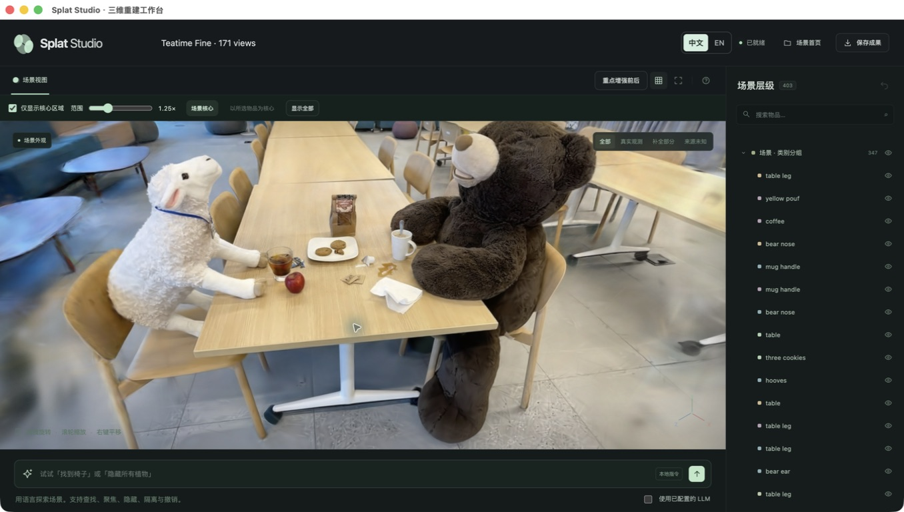
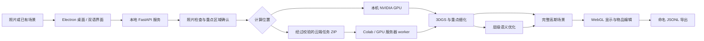

<div align="center">

# Splat Studio

### 从照片，到可理解、可操作的三维场景

把 **3D 高斯重建、稀疏视角处理、层级语义与重要物品细化** 连接成完整桌面工作流。

[English](README.md) · **简体中文** · [完整使用说明](docs/user-guide.html) · [Colab 笔记本](colab/Splat-Studio-User-Guide.ipynb) · [精细实测展示](docs/fine-evaluation/README.md)



</div>

## 看实际运行效果

[**查看中英文精细模式截图展示 →**](docs/fine-evaluation/README.md)

两组实际 **A100、22,000 步**训练，展示 **171 张照片的常规重建**与 **6 张照片的稀疏重建及可见几何补全**，随后完成层级语义与原生物品编辑。

**整体 PSNR 26.08 dB · 咖啡杯区域 SSIM 0.921 · 小熊玩偶 IoU 94.2%**

整体 PSNR 取完整输入组的六个独立测试视角；咖啡杯区域 SSIM 为五个标注视角的平均值，是两个预先指定重点类别中平均 SSIM 较高的一类；语义亮点按至少两个标注视角的最佳类别汇总分数选择，所属实验及全部类别分数见[完整评测](docs/fine-evaluation/精度评测.html)。[协议与指标](docs/fine-evaluation/README.md) · [执行记录](docs/fine-evaluation/execution-record.json)。

## 从输入照片，到保存可交互的场景

Splat Studio 面向希望把照片重建成三维场景、并直接操作其中物品的用户。系统把照片检查、重建方案、GPU 环境、重点区域确认、训练和成果查看串成一个循序渐进的流程。

进入应用后选择 **从 0 开始重建** 或 **导入已有重建**。稀疏重建与补全建议在读取照片后按需出现。右上角 **中文 / EN** 可以即时切换语言，保留当前步骤、输入和场景，重启后记住选择。

| 已实现的能力 | 用户得到什么 |
| --- | --- |
| **从自己的照片重建** | 命名场景、导入照片、检查重复与重叠、确认策略；正式重建时估计相机位姿。 |
| **稀疏视角与可见区域补全** | 根据输入选择几何路径，结合 SfM 和 DUSt3R；通过对齐与一致性检查后接纳推断点。 |
| **重要物品更精细重建** | 输入物品名称、核对真实像素区域，以加权损失、高分辨率细化和有限增密分配更多计算。 |
| **层级与跨视角语义** | 关联不同视角的物品区域，建立物体/部件层级，使用置信度加权的多轮高斯语义优化。 |
| **本地与云端 GPU** | 在已配置的本机 NVIDIA 环境训练，或通过校验后的任务包接入 Colab、GPU 服务器、WSL2 与容器。 |
| **物品级交互编辑** | 旋转、平移、缩放、搜索、定位、隔离、隐藏和撤销；支持本地语言指令与可选 LLM。 |
| **完整高斯与球谐显示** | 载入全部输入高斯和模型实际具有的 SH0–3 系数，按场景或物品核心过滤远处背景。 |
| **保存与再次导入** | 导出以场景命名的流式 JSONL，保存几何、已有语义和显示设置；支持完整场景或配套 PLY + 语义包导入。 |

## 快速体验

1. 打开应用，选择 **从 0 开始重建**。
2. 给场景命名，添加同一静态场景的重叠照片。
3. 确认照片分析结果，选择仅重建外观或同时识别物品。
4. 需要重点细化时，输入物品并确认照片中的实际区域。
5. 选择 **快速 / 均衡 / 精细** 和本机或云端 NVIDIA GPU。
6. 完成训练；云端路线下载并导回完整结果，然后进入场景操作。
7. 保存为 **`场景名.splat.jsonl`**，之后可再次导入。

[中英文使用说明](docs/user-guide.html) 覆盖识别、确认、训练、导入、手动标注和各类环境配置。下载 HTML 后在浏览器打开，即可使用语言切换。配套笔记本可直接上传到 Colab。

## 核心实现

### 以照片证据决定稀疏几何路径

照片导入时处理 EXIF 方向、记录图片身份。预检结合重复检测、特征匹配、照片关联和可选覆盖角度，给出重建建议。正式几何阶段优先使用经过验证的 SfM，并检查相机注册、重投影与视差。稀疏输入可通过固定版本的 **DUSt3R** 恢复可见几何，在接纳补充点前进行对齐与一致性验证。来源信息随点保留，供查看器区分观测、推断和未知来源。

代码：[`planning.py`](backend/planning.py)、[`capture.py`](backend/capture.py)、[`sparse_geometry.py`](backend/sparse_geometry.py)、[`learned_geometry.py`](backend/learned_geometry.py)。

### 重要物品有实际的训练预算

系统将用户描述解析成候选物品，再展示照片中的匹配区域供确认，边界物品也进入核对流程。确认后的掩码提高对应区域的 RGB 误差权重；最后的细化阶段使用更高分辨率和受限增密预算。高斯谱系追踪在点集变化后保持语义对应。结果可携带同视角细化前后图像和区域指标，在 App 中直接检查。

代码：[`priority_workflow.py`](backend/priority_workflow.py)、[`priority_detail.py`](backend/priority_detail.py)、[`gaussian_lineage.py`](backend/gaussian_lineage.py)、[`upstream.py`](backend/upstream.py)。

### 层级语义与多视角置信度共同参与

语义输入支持 **Grounding DINO + SAM** 掩码、手动物体/部件标注，以及 **LaGa 格式的多粒度区域与描述子数组**。几何关联匹配跨视角区域，构建描述子分组和有监督支持的父子关系。

RGB 重建完成后冻结几何，通过可微高斯渲染优化每个高斯的独立类别概率。改进目标结合类别均衡 BCE、Dice、边界不确定性权重、跨视角置信度、层级一致性和高置信先验。漏检区域按未知处理，不直接当成负样本。训练视角和轮数随档位调整，并覆盖有效监督对。

代码：[`semantic_granularity.py`](backend/semantic_granularity.py)、[`semantic_refinement.py`](backend/semantic_refinement.py)、[`semantic_service.py`](backend/semantic_service.py)、[`import_laga_regions.py`](scripts/import_laga_regions.py)。

### 完整显示与可逆编辑

Three.js / WebGL 查看器保留输入模型实际具有的球谐系数，使用流式场景传输，分别显示“已载入”和“当前可见”数量。核心区域过滤让用户集中查看主体；物品选择、层级显示、隔离和撤销作用于保留的场景数据。原生保存将数据分块写入临时文件，完整写入后才提交最终文件。

代码：[`viewer.js`](frontend/viewer.js)、[`gaussian_sh.js`](frontend/gaussian_sh.js)、[`core_region.js`](frontend/core_region.js)、[`scene_transport.js`](frontend/scene_transport.js)、[`scene-export.cjs`](desktop/scene-export.cjs)。

## 三种计算预算

| 模式 | RGB 总步数 | 常规图像尺度 | 语义视角预算 | 语义基础步数 | 重点细化，计入 RGB 总数 |
| --- | ---: | --- | --- | ---: | ---: |
| 快速 | 7,000 | 宽高各约 ¼ | 最多 12 个 | 400 | 400 |
| 均衡 | 15,000 | 宽高各约 ½ | 最多 24 个 | 1,200 | 1,200 |
| 精细 | 22,000 | 原图尺度 | 全部训练视角 | 2,400 | 2,400 |

**每个档位均执行层级处理和跨视角置信度。** 为覆盖有效视角/类别对，语义实际步数可能增加。App 按设备和预算估计计算时间，也可使用用户提供的实测速率；本机训练期间根据近期迭代计算当前训练循环的 ETA。

## 系统架构



原生应用启动仅监听回环地址的后端，通过每次启动生成的令牌认证请求。云任务携带照片身份、配置和完整性信息，worker 在执行前校验。API 凭据通过环境变量配置，不自动写入任务包。

## 从源码运行

准备 Node.js 22 与标准 Python 3.12，在仓库根目录运行：

```bash
git clone https://github.com/Xuyw041006-arch/splat-studio.git
cd splat-studio
python3 -m venv .venv
source .venv/bin/activate
python -m pip install -r requirements-semantic.txt
corepack enable
corepack prepare pnpm@11.19.0 --activate
pnpm install --frozen-lockfile
pnpm run build
export SPLAT_PYTHON="$PWD/.venv/bin/python"
pnpm run desktop
```

Windows 使用 `py -3.12 -m venv .venv` 创建环境，以 `.\.venv\Scripts\Activate.ps1` 激活，并在运行桌面前设置 `$env:SPLAT_PYTHON=(Resolve-Path .\.venv\Scripts\python.exe).Path`。本机训练还需按使用说明完成 NVIDIA 工具链配置。

云服务器上，准备与执行分开进行：

```bash
python scripts/splat_env.py prepare --task /path/task.zip --base /workspace/splat-gpu
# 替换为 prepare 打印的本次任务目录：
python scripts/splat_env.py run --job /workspace/splat-gpu/TASK_DIRECTORY
```

本机 CUDA 环境通过 `scripts/splat_env.py local` 指定源码和环境目录配置，详细路径与启动命令见使用说明。

### 构建桌面包

```bash
python scripts/build_backend.py --semantics --geometry
pnpm run package:mac   # 在 macOS 上构建
pnpm run package:win   # 在 Windows 上构建
```

各平台后端需在对应操作系统构建。仓库还包含 [Windows 便携包组装脚本](scripts/build_portable_windows.py) 与 [运行时锁定清单](docs/WINDOWS-RUNTIME-LOCK.json)。二进制分发包和预训练权重放在源码历史之外；架构要求、启动步骤与环境验证状态见完整使用说明。

## 工程验证与评估工具

测试覆盖照片分析、几何校验、语义置信度与层级、重点掩码确认、高斯谱系、场景传输、完整 SH 打包、可逆显示、任务完整性和原生导出权限。

```bash
python -m pip install -r requirements-dev.txt
python -m pytest tests
node --test tests/*.mjs tests/*.cjs
pnpm run build
```

双语测试检查切换时保留输入、动态进度翻译、用户标签不变、语言跨重启保存及 IPC 授权。[`benchmarks/`](benchmarks/) 提供可复用评估工具，[`benchmark_sparse_photos.py`](scripts/benchmark_sparse_photos.py) 用于稀疏照片流程。具体实验的 PSNR、SSIM、mIoU 与边界 IoU 应由该实验的独立评估视角和标注计算。

## 目录

```text
backend/       照片、几何、重建、语义、任务接口
frontend/      引导流程、翻译、高斯渲染、物品交互
desktop/       原生生命周期、语言偏好、安全保存
scripts/       GPU 环境、云端 worker、源码与应用打包
colab/         笔记本工作流
configs/       训练配置
tests/         Python、前端与桌面验证
benchmarks/    可复用评估工具
docs/          双语说明和运行时文档
```

## 研究基础与致谢

重建后端基于官方 [3D Gaussian Splatting](https://github.com/graphdeco-inria/gaussian-splatting)。稀疏几何使用 [DUSt3R](https://github.com/naver/dust3r)，区域准备使用 [Grounding DINO](https://github.com/IDEA-Research/GroundingDINO) 与 [SAM](https://github.com/facebookresearch/segment-anything)。[SAGA](https://github.com/Jumpat/SegAnyGAussians) 和 [LaGa](https://github.com/SJTU-DeepVisionLab/LaGa) 为语义设计与多粒度数据接入提供参考；本项目的具体实现见上文及对应源码。

上游归属与条款见 [第三方说明](THIRD_PARTY_NOTICES.md)。公开仓库包含应用源码、文档、配置和测试，照片集、用户素材、训练模型、凭据和历史结果包保留在仓库之外。
