# Splat Studio — 图文功能展示

[English](README.md) · **简体中文** · [返回项目首页](../../README.zh-CN.md)

24 组来自 macOS 原生 App 的实际操作截图，包含中英文原图与配文卡片。真实 Teatime 快速任务使用 177 张照片，在 A100 上训练，完整导出 **1,200,686 个高斯和三阶球谐**。

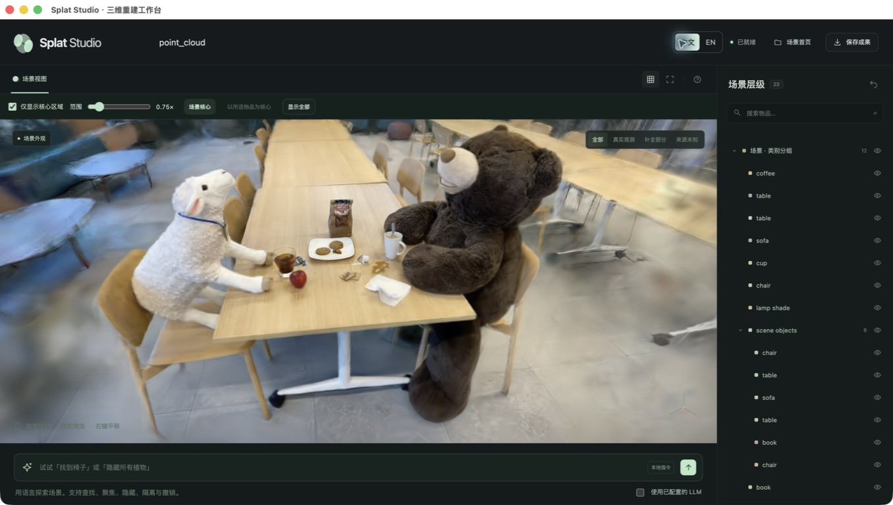

下方可直接在 GitHub 浏览完整截图。使用带语言切换、章节筛选和图片放大的版本时，下载仓库 ZIP，保持 `docs/demo/` 目录完整，再打开 **图文展示.html**。**项目报告.html** 提供双语系统与实测报告；[Markdown 报告](方法与实测说明.md) 可直接在这里阅读。

六照片和双照片分支展示输入判断、标注与任务准备，实际训练的展示模型来自完整 177 张照片。快速语义仍为部分区域覆盖；图册展示真实区域编辑，[执行记录](execution-record.json) 说明具体实测范围。

## 01. 两种入口，清晰开始

从照片新建场景，或导入已经完成的重建。首页只保留这两个入口。

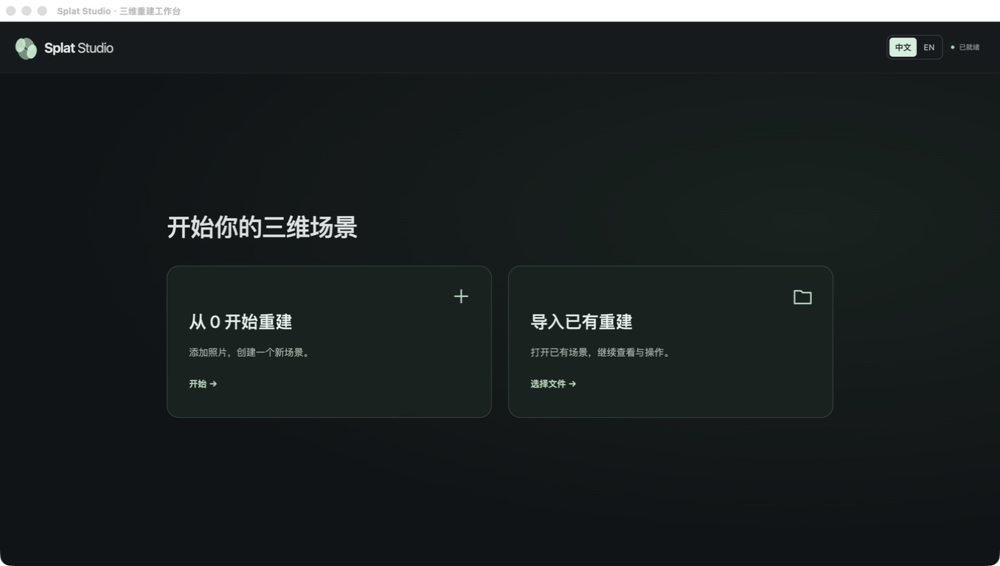

## 02. 为场景命名，加入照片

这次演示使用 Teatime 图片集。场景名称会沿用到后续的保存与导出流程。

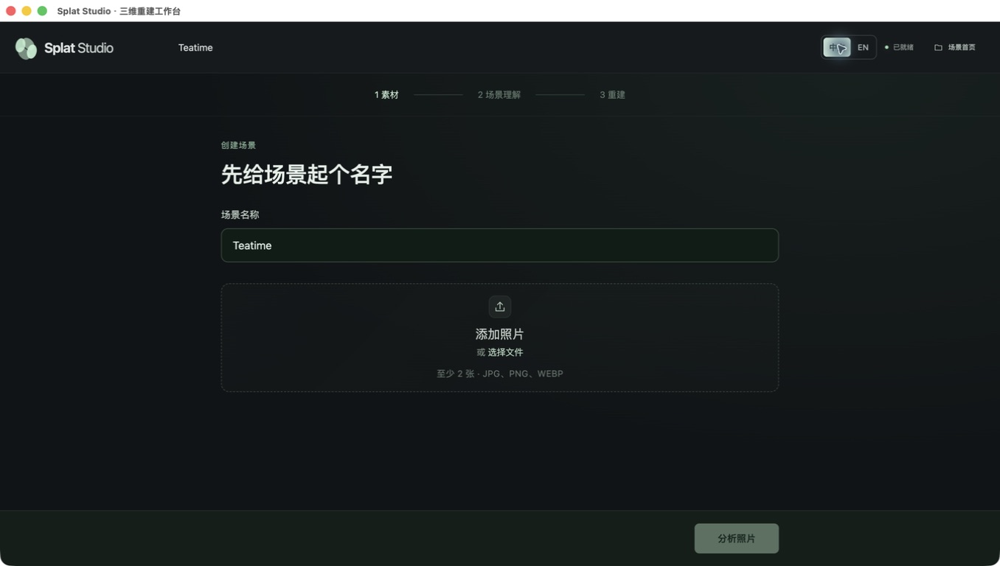

## 03. 让照片决定下一步

本次读入 177 张照片，177 张独立照片，连接度预检为 97%，App 建议直接重建。连接度是照片重叠的预检指标；相机位姿在后续重建中求解。

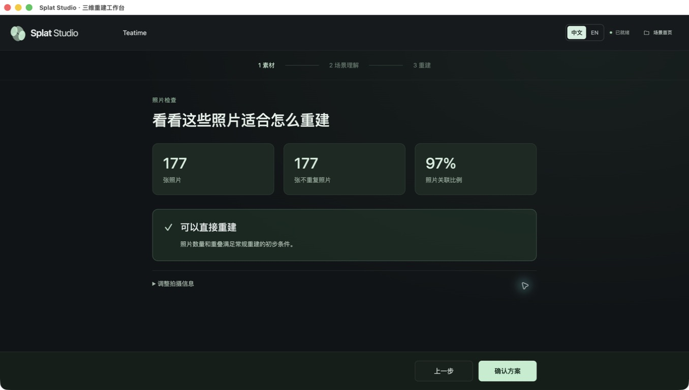

## 04. 六张照片，按需进入稀疏流程

导入真实的 6 张 Teatime 照片后，App 检测到重叠并建议稀疏重建，同时允许按需补全。此页验证输入判断；本次新训练的展示模型来自完整 177 张照片。

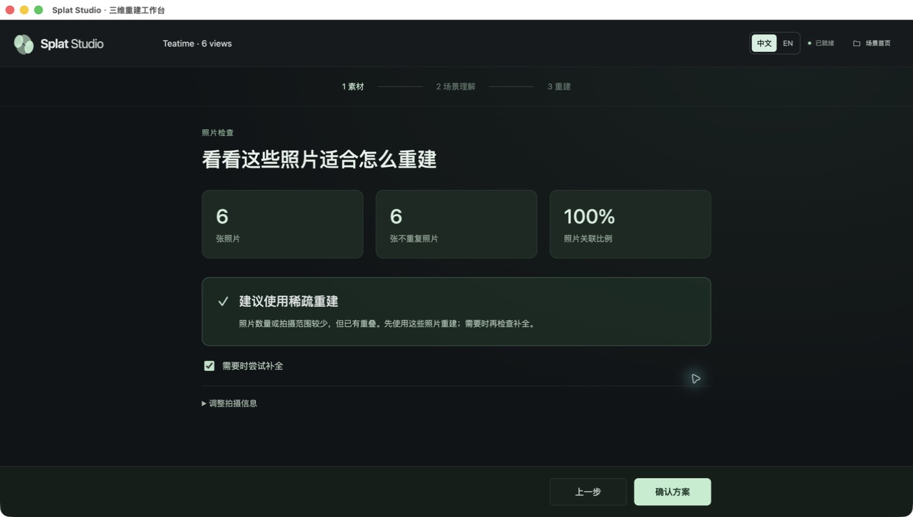

## 05. 只有两个视角时，提示补全

导入两张照片后，App 建议稀疏重建并补全，也提醒看不到的背面可能缺失。本图验证自动建议与选择入口，没有将未知背面描述为已恢复的真实几何。

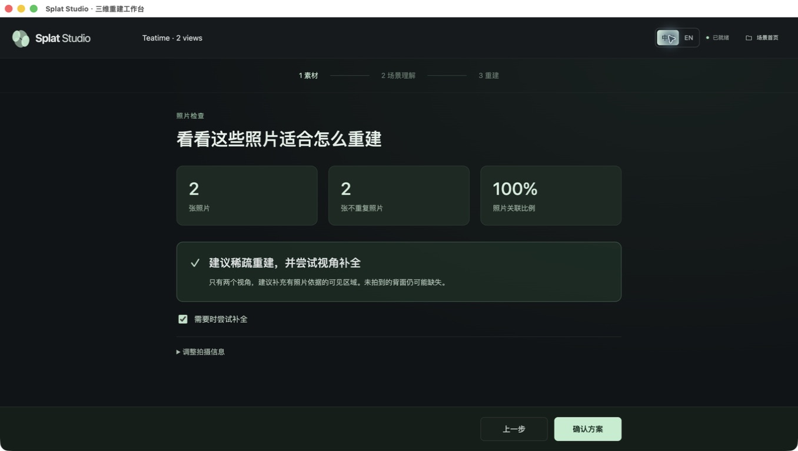

## 06. 自己的照片也可以作为输入

已知拍摄覆盖角度时可以填写，并可导入与照片匹配的标定内参。相机位姿由照片求解；数量与连接度预检不等同于已经恢复精确拍摄角度。

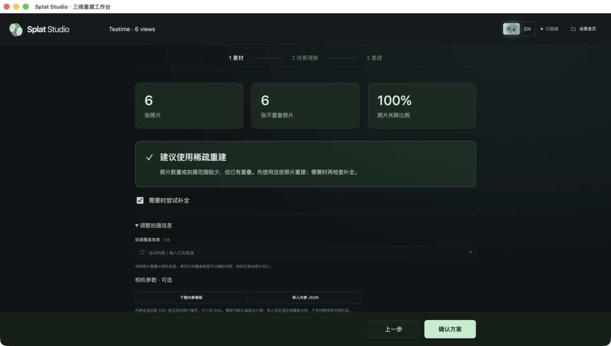

## 07. 按需要加入物品识别

只想查看场景外观，可以选择普通重建；需要按物品查找和编辑，则开启语义功能。

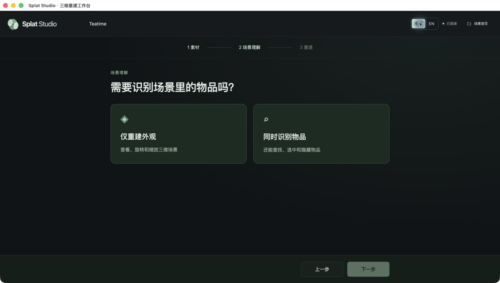

## 08. 告诉 App，哪些物品更重要

本次输入“熊、咖啡杯”。这些名称用于匹配照片中的真实区域，核对区域后才能用于重点训练。切换界面语言会保留用户原始输入。

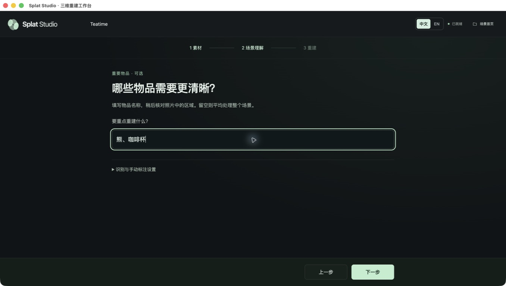

## 09. 直接在照片上标出重要物品

在 6 张照片示例中，沿熊的可见上身绘制 35 个顶点，并实际保存掩码。名称、跨视角 ID 与层级用于组织标注；同一实例仍需要其他视角的证据。

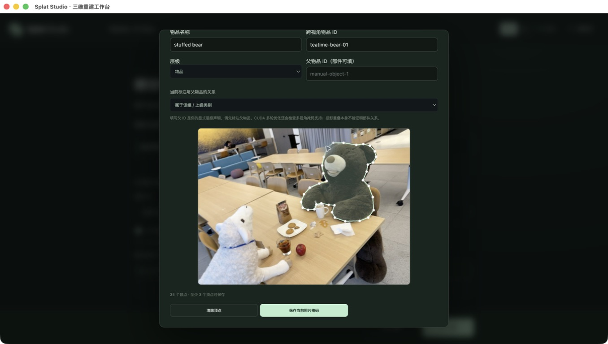

## 10. 核对实际区域，再用于重点训练

绿色覆盖对应刚刚保存的手工区域，确认后才进入任务。图中的 100% 是手工标注的记录分数，不代表分割准确率。真实 A100 训练另外核对了 28 个候选，保留 11 个区域。

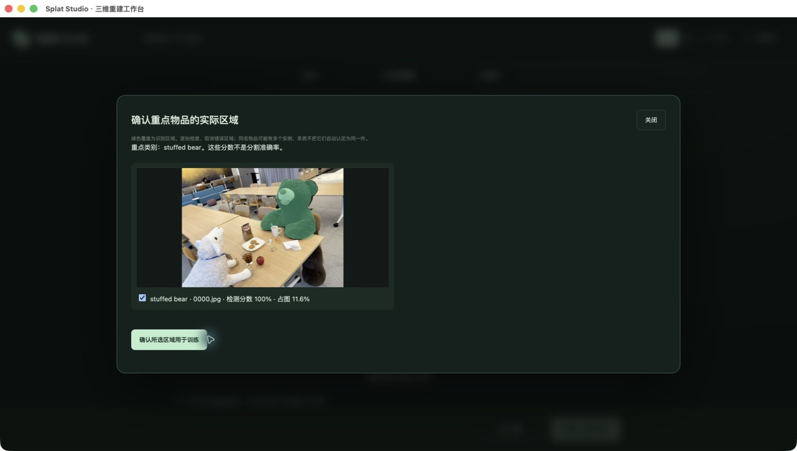

## 11. 选择效果与计算设备

此次实际任务选择快速模式和 Colab A100：7,000 步 RGB 训练，语义基础预算 400 步、最多抽取 12 个视角；重点细化使用最后 400 步预算。

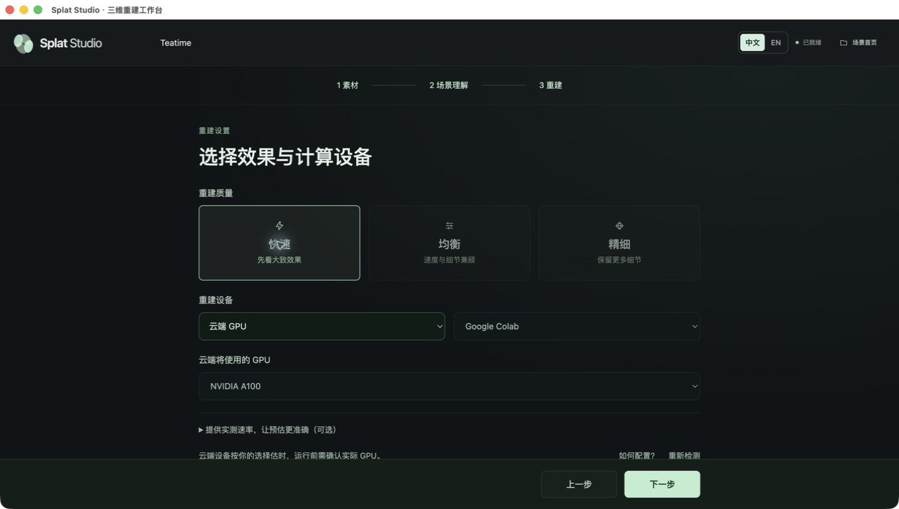

## 12. 开始前，核对时间和配置

确认页展示场景、照片数量、模式、设备和预估耗时。本次页面估算为 8–27 分钟；实际执行耗时单独记录。

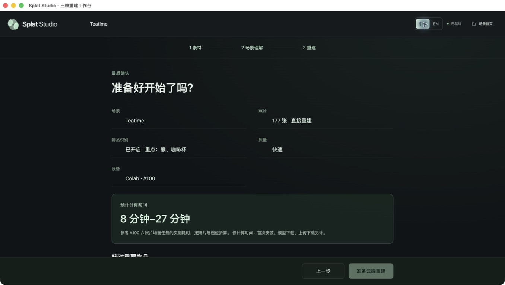

## 13. 没有 GPU 服务器，也能使用 Colab

App 内置 Colab 配置说明，通过任务 ZIP 与结果文件完成云端交换。这次演示在真实 A100 环境中执行。

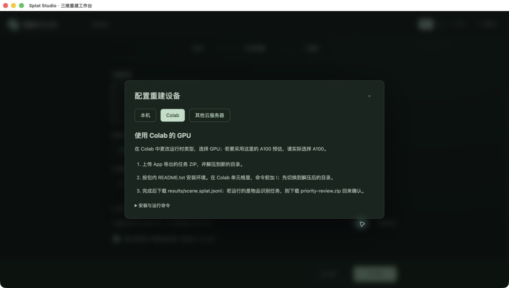

## 14. 本地 NVIDIA 环境有对应指引

用户可以查看 Windows / Linux 的本地 CUDA 训练配置步骤。这里展示的是 App 内的配置说明。

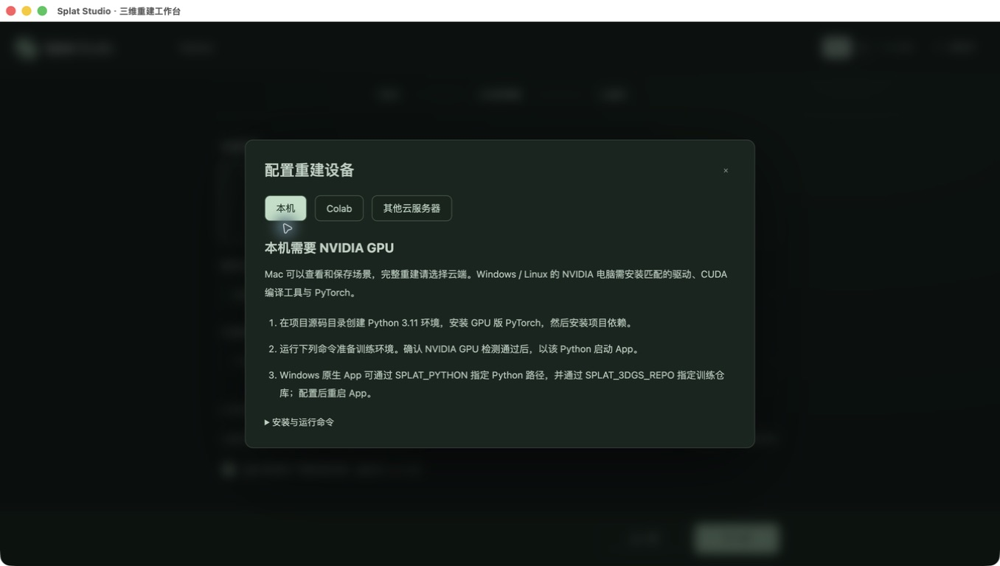

## 15. 也可以连接自己的云端工作流

其他云服务器同样使用任务包执行方式。依赖安装、任务启动与结果导回步骤集中在 App 内的说明中。

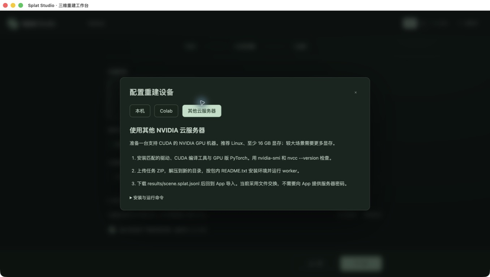

## 16. 任务带着照片和设置交给云端

六照片示例已实际导出任务 ZIP，包含确认的重点区域。按包内说明在云端执行，再回到 App 导入结果。这一示例停在任务准备阶段，页面明确显示尚未训练。

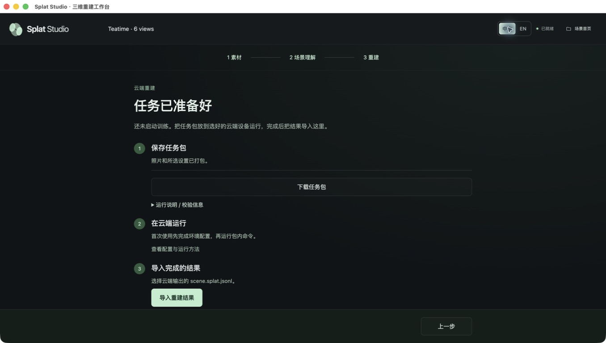

## 17. 已有成果，直接打开

导入时先选择场景是否包含物品语义。只有外观的模型同样可以进入三维浏览；语义模型还能按物品进行操作。

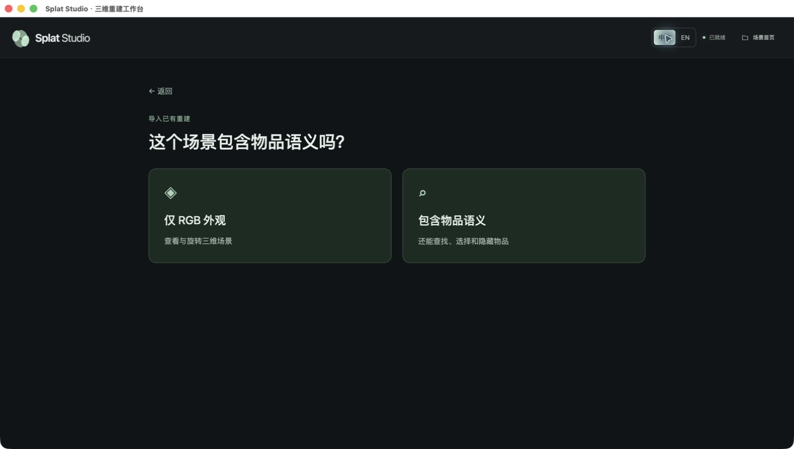

## 18. 让高斯与语义正确配对

本次导入真实训练得到的 point_cloud.ply 和配套 semantics.zip。App 校验模型与语义的对应关系，再打开完整场景。

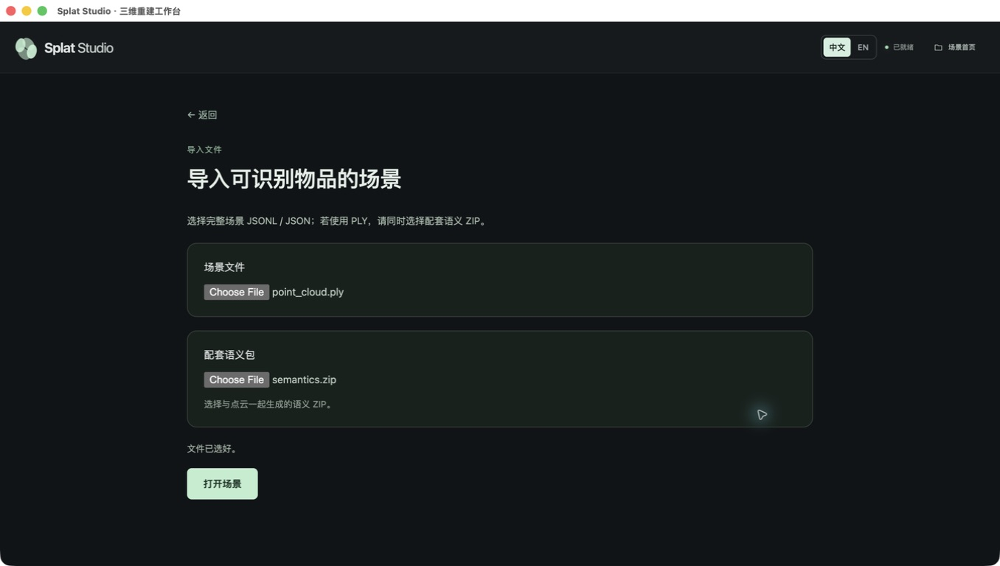

## 19. 打开真实训练的 Teatime

177 张照片在 A100 上完成快速训练。完整模型包含 1,200,686 个高斯和三阶球谐；核心区域筛选只影响显示。拖拽旋转、滚轮缩放、右键平移。

## 20. 搜索物品，查看区域置信度

输入 table 筛选语义目录，选中区域显示 14,543 个高斯和 52% 跨视角置信度。该数值是匹配权重；此次区域只覆盖桌面的一部分。

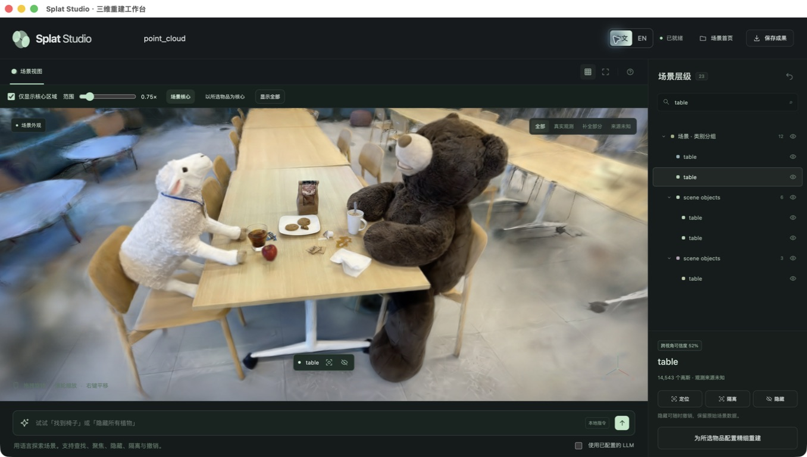

## 21. 隐藏与撤销，保留原始数据

隐藏选中的语义区域后，其对应高斯从画面中消失。已验证撤销恢复；隐藏不会删除源文件，也不会自动填补露出的空洞。

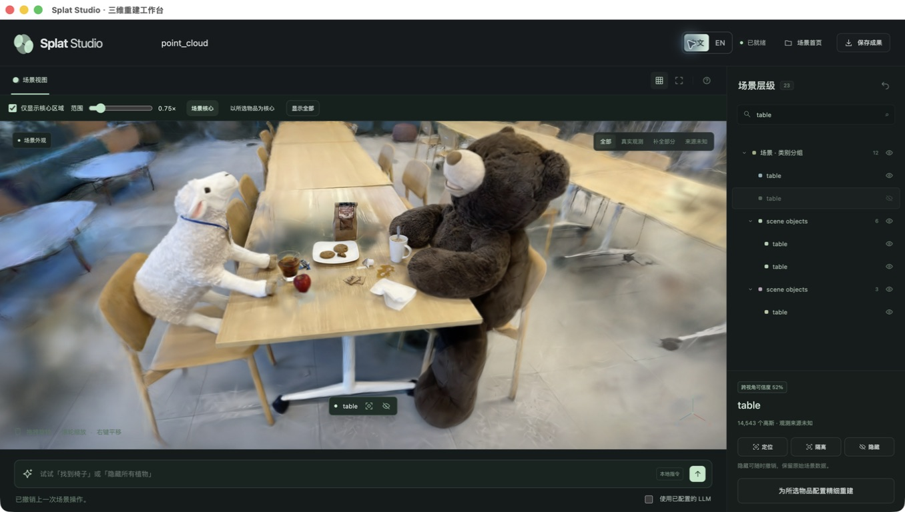

## 22. 一句指令，恢复场景

输入 undo，App 执行本地文字指令并恢复被隔离的场景。已验证文字撤销；界面也提供查找、定位、隐藏等指令入口。

## 23. 隔离区域，检查语义覆盖

隔离选中的桌面区域，直接检查当前训练覆盖了哪些高斯。快速版的覆盖仍有空缺；这张实测截图展示区域隔离操作。

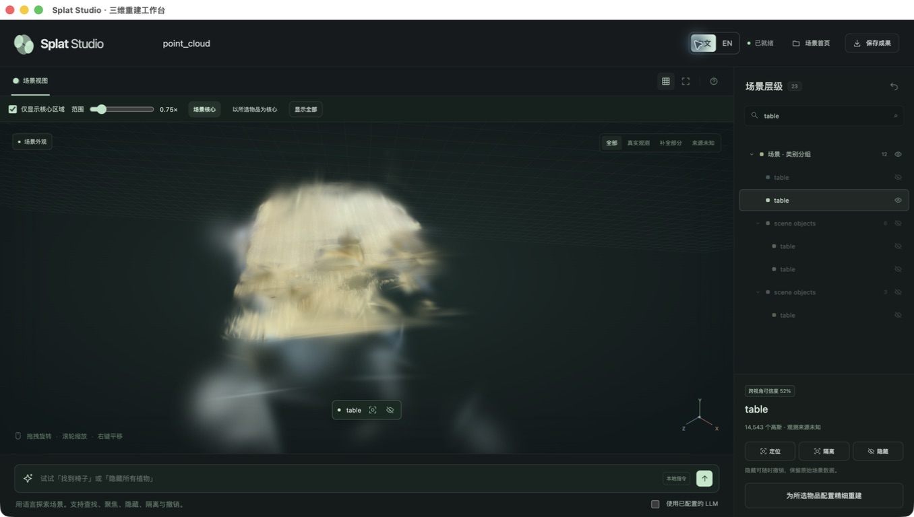

## 24. 保存完整场景，继续使用

原生 App 已实际导出完整 .splat.jsonl，包含所有高斯、球谐系数、已有语义和当前显示设置。此处将文件命名为 Teatime-Fast；保存窗口的系统按钮跟随 macOS 语言。

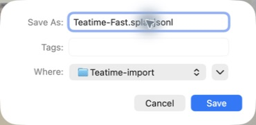

`cards/` 保存 48 张可用于演示的配文图片，`screenshots/` 保存 48 张未经修改的原始截图。训练模型产物独立保存，不包含在此展示目录中。
