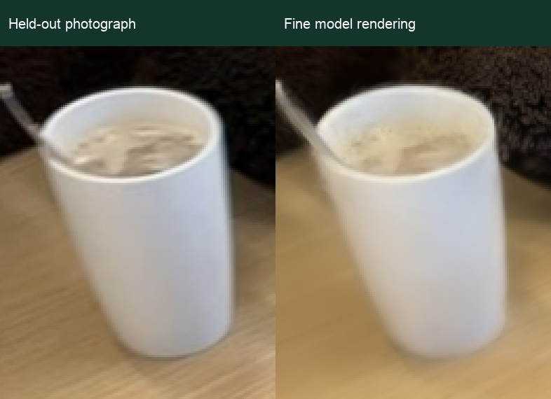
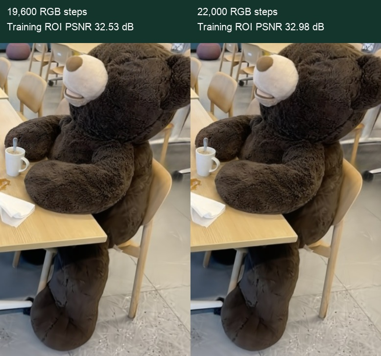
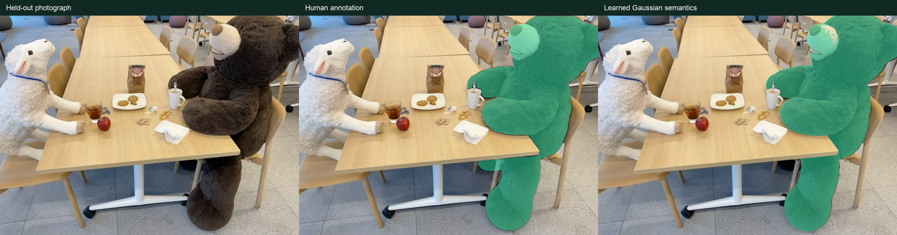
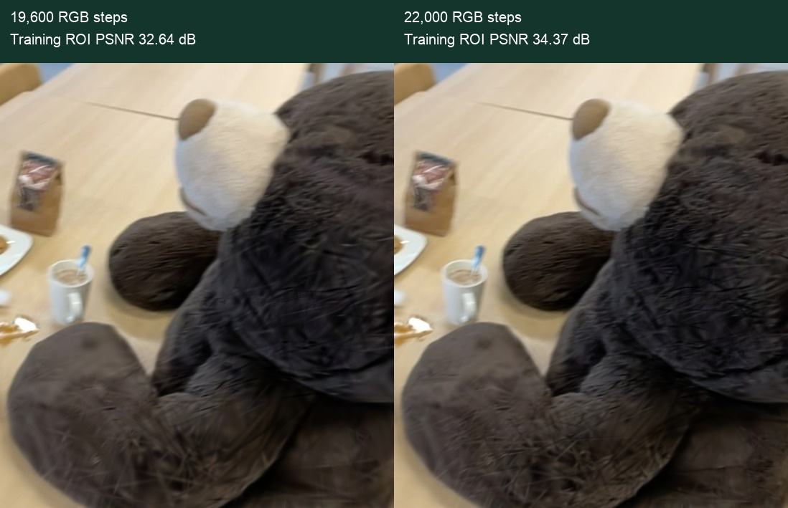
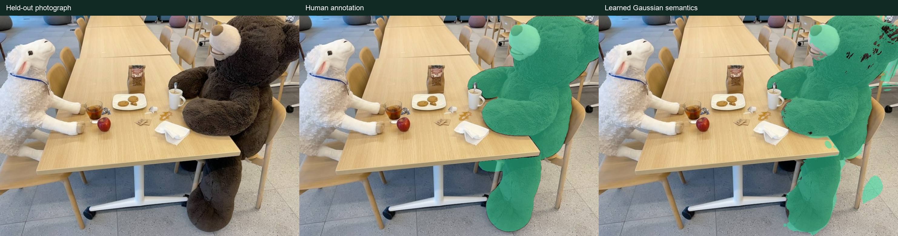

# Splat Studio · Fine measurements / 精细模式实测

**A100 · 22,000 RGB steps · 171-photo reconstruction and six-photo sparse reconstruction · 中文 / English**

[双语精度展示 / Bilingual measurements](精度评测.html) · [完整项目报告 / Whole-project report](项目报告.html) · [执行记录 / Execution record](execution-record.json)

The comparisons below are actual CUDA renders from the two completed Fine models. Native screenshots document creation of these training tasks. 下方对比来自两组已完成精细模型的实际 CUDA 渲染；原生截图记录这些训练任务的创建过程。

## Overall, priority and segmentation / 整体、重点区域与分割

| Metric / 指标 | 171 inputs / 张 | 6 inputs / 张 |
| --- | ---: | ---: |
| Overall PSNR / 整体 PSNR | 26.08 dB | 22.61 dB |
| Overall SSIM / 整体 SSIM | 0.867 | 0.711 |
| Priority ROI PSNR / 重点区域 PSNR | 27.99 dB | 23.03 dB |
| Priority ROI SSIM / 重点区域 SSIM | 0.779 | 0.594 |
| Segmentation mIoU / 分割 mIoU | 41.2% | 21.4% |
| Boundary IoU / 边界 IoU | 11.5% | 3.6% |

Registered test views / 注册成功的测试视角：full 6/6, sparse 2/6.

Aggregates use each run’s accepted test cameras; differing coverage is shown explicitly. 上表各组使用实际注册成功的测试相机，下表限定相同测试照片。

### Same-view comparison / 相同视角对比 · 2 views

| Metric / 指标 | 171 inputs / 张 | 6 inputs / 张 |
| --- | ---: | ---: |
| Overall PSNR / 整体 PSNR | 28.51 dB | 22.61 dB |
| Overall SSIM / 整体 SSIM | 0.879 | 0.711 |
| Priority ROI PSNR / 重点区域 PSNR | 30.56 dB | 23.03 dB |
| Priority ROI SSIM / 重点区域 SSIM | 0.819 | 0.594 |
| Segmentation mIoU / 分割 mIoU | 42.7% | 21.4% |
| Boundary IoU / 边界 IoU | 13.2% | 3.6% |

Shared test photos / 共同测试照片：frame_00002.jpg, frame_00107.jpg. [JSON](measurements/common-view-metrics.json).

Six photographs and human semantic masks are held out before training. Neither run receives the authors’ full-scene cameras or point cloud; test poses are registered to frozen training geometry. PSNR/SSIM measure rendered image quality, and priority scores are absolute ROI quality. No matched priority-disabled ablation was run.

六张照片及其人工语义标注预先留出，两组训练均不输入作者的完整相机和点云；测试相机注册到固定的训练几何。PSNR／SSIM 衡量渲染图像质量，重点区域分数是绝对画质；本次没有同配置关闭重点训练的消融对照。完整页面保留全部类别与注册失败原因。

## Priority refinement and semantics / 重点细化与语义

**Coffee mug ROI SSIM 0.921**, averaged over 5 annotated test views. The crop is shown at 3× pixel scale, selected at the median ROI-SSIM rank. **咖啡杯区域 SSIM 0.921**，为 5 个标注测试视角平均值；图中按区域 SSIM 中位位置选取视角，放大三倍像素显示。

Priority before/after figures use training cameras and illustrate the executed refinement stage. Semantic panels use a category’s median test-IoU view; headline class IoU pools multiple annotated views. 细化前后图来自训练相机，用于展示实际执行过程；语义对照选取该类别测试 IoU 中位位置的视角，类别亮点分数按多个标注视角汇总。

## Native task creation / 原生任务创建

### Two ways to begin / 两种开始方式

Build a new scene from photographs, or import an existing reconstruction to explore and edit. Switch between Chinese and English in place.

从照片建立新场景，或导入已有重建继续浏览和编辑。中文与英文可以随时切换。

中文截图 / Chinese screenshot

### Check the capture before choosing a strategy / 先检查照片，再决定怎么重建

The 171 input photos have strong match connectivity, so the App recommends standard reconstruction. Six test photographs were held out before training.

171 张输入照片具有较好的匹配连通性，App 建议直接重建。六张测试照片已提前留出，未进入训练。

中文截图 / Chinese screenshot

### Tell the system what deserves more detail / 告诉系统哪些物品更重要

This run prioritizes stuffed bear and coffee mug. Actual detected regions are reviewed before the approved masks drive weighted optimization and refinement.

本次输入 stuffed bear 与 coffee mug。后续审核实际检测区域，确认后的掩码参与重点加权与细化训练。

中文截图 / Chinese screenshot

### Fine mode on a cloud A100 / 精细模式与云端 A100

Both experiments use Fine mode: 22,000 RGB steps with all valid training views included in semantic optimization. The App estimates time from the device and selected budget.

两组实验均选择精细模式：22,000 步 RGB 训练，全部有效训练视角参与语义优化。App 根据设备与预算显示预计时间。

中文截图 / Chinese screenshot

### Review and confirm priority regions / 审核并确认重点区域

Inspect candidate masks and border warnings before approval. The English capture shows review; the full task subsequently confirms 252 image regions for training.

逐张核对识别区域，剔除误认和重复候选，再将确认结果加入训练。中文截图显示本次完整任务已确认 252 个照片区域。

中文截图 / Chinese screenshot

### Six photos trigger the sparse route / 六张照片，触发稀疏策略

Low photo connectivity prompts sparse reconstruction with completion as needed. This run actually uses learned geometric initialization, cross-view depth constraints and 3DGS optimization.

照片连通性较低时，App 才建议稀疏重建与按需补全。本次训练实际使用学习几何初始化、跨视角深度约束与 3DGS 优化。

中文截图 / Chinese screenshot

## Data attribution / 数据署名

Teatime photographs and human semantic annotations are from the expanded LERF data provided by [LangSplat](https://github.com/minghanqin/LangSplat#datasets). 本展示的 Teatime 照片与人工语义标注来自 LangSplat 提供的扩展 LERF 数据。Complete datasets and model weights are excluded from the repository.
