# Splat Studio · Fine screenshot walkthrough / 精细模式图文展示

**Actual A100 training · 22,000 RGB steps · full input and six-view sparse reconstruction · 中文 / English**

[双语图文展示 / Bilingual gallery](图文展示.html) · [系统报告 / System report](项目报告.html) · [完整评测 / All measurements](精度评测.html) · [执行记录 / Execution record](execution-record.json)

HTML pages include a Chinese/English switch; download the `docs/fine-evaluation` folder to open them with all images. 下方可直接在 GitHub 浏览截图；下载整个 `docs/fine-evaluation` 文件夹可离线打开带语言切换的 HTML 页面。

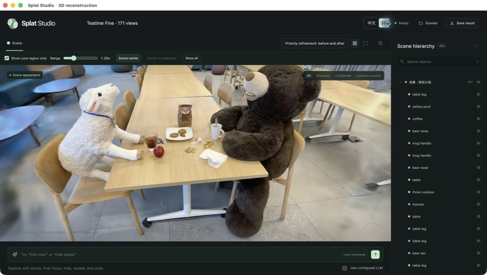

## Measured rendering and semantics / 重建与语义实测

**Full-input highlights / 完整输入实测亮点: PSNR 26.08 dB · Coffee mug / 咖啡杯 ROI SSIM 0.921 · Stuffed bear / 小熊 IoU 94.2%**

Coffee-mug detail averages five annotated held-out views and is the higher mean ROI SSIM among the two predeclared priority categories. Bear IoU pools its five annotated views. 咖啡杯区域取五个标注测试视角的均值，是两个预先指定重点类别中平均区域 SSIM 较高的一类；小熊 IoU 汇总其五个标注视角。

| Metric / 指标 | 171 inputs / 张 | 6 inputs / 张 |
| --- | ---: | ---: |
| Overall PSNR / 整体 PSNR | 26.08 dB | 22.61 dB |
| Overall SSIM / 整体 SSIM | 0.867 | 0.711 |
| Priority ROI PSNR / 重点区域 PSNR | 27.99 dB | 23.03 dB |
| Priority ROI SSIM / 重点区域 SSIM | 0.779 | 0.594 |
| Segmentation mIoU / 分割 mIoU | 41.2% | 21.4% |
| Boundary IoU / 边界 IoU | 11.5% | 3.6% |
| Registered held-out views / 成功注册的测试视角 | 6 / 6 | 2 / 6 |

Six annotated photographs are held out before training. Both runs start from their own input photos; test cameras are registered to frozen training geometry. Scores use complete Gaussians and the saved raw semantic probabilities. PSNR/SSIM describe image quality; priority scores are absolute ROI quality without a matched priority-disabled ablation.

预先留出六张有人工标注的照片。两组均从各自输入照片重建，测试相机注册到已固定的训练几何；评测使用全量高斯与保存的原始语义概率。PSNR／SSIM 衡量渲染画质；重点区域为绝对质量，未用关闭重点训练的同配置对照建立因果增益。

| Full input / 完整输入 | Six-view sparse / 六视角稀疏 |
| --- | --- |
|  | 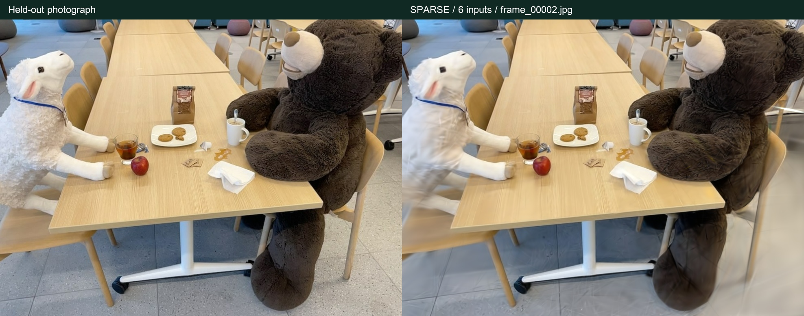 |

The representative renderings use the median test PSNR rank. The highlighted semantic class pools annotated views rather than selecting a best single frame; every class remains in the complete report. 对照渲染按测试 PSNR 的中位位置选择。语义亮点使用跨视角汇总类别分数，完整报告保留全部类别。

### Same-view comparison / 相同测试范围对比

The table above uses each run’s registered test views. The following comparison uses only the **2 shared views**: frame_00002.jpg, frame_00107.jpg. 上表各组按实际注册成功的照片统计；下表仅比较两组共同的测试照片。注册失败的视角和原因保留在完整评测中。

| Metric / 指标 | 171 inputs / 张 | 6 inputs / 张 |
| --- | ---: | ---: |
| Overall PSNR / 整体 PSNR | 28.51 dB | 22.61 dB |
| Overall SSIM / 整体 SSIM | 0.879 | 0.711 |
| Priority ROI PSNR / 重点区域 PSNR | 30.56 dB | 23.03 dB |
| Priority ROI SSIM / 重点区域 SSIM | 0.819 | 0.594 |
| Segmentation mIoU / 分割 mIoU | 42.7% | 21.4% |
| Boundary IoU / 边界 IoU | 13.2% | 3.6% |

[Shared-view JSON / 共同视角完整指标](measurements/common-view-metrics.json)

## From photographs to interaction / 从照片到交互

### 01. Two ways to begin / 两种开始方式

Build a new scene from photographs, or import an existing reconstruction to explore and edit. Switch between Chinese and English in place.

从照片建立新场景，或导入已有重建继续浏览和编辑。中文与英文可以随时切换。

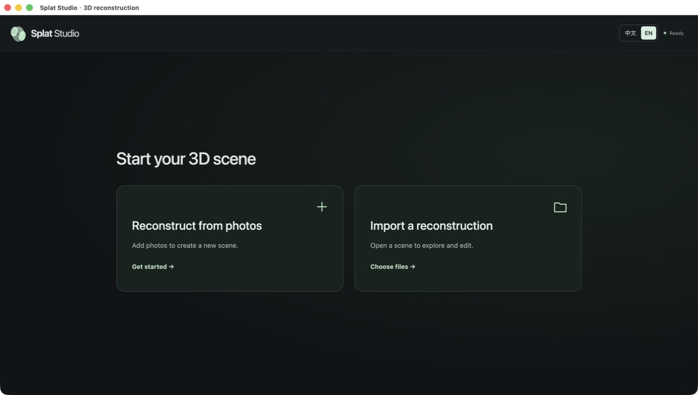

中文界面截图 / Chinese interface

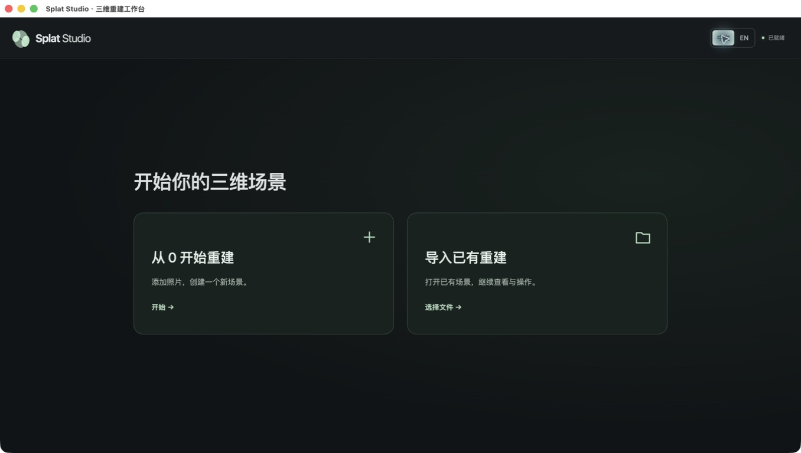

### 02. Check the capture before choosing a strategy / 先检查照片，再决定怎么重建

The 171 input photos have strong match connectivity, so the App recommends standard reconstruction. Six test photographs were held out before training.

171 张输入照片具有较好的匹配连通性，App 建议直接重建。六张测试照片已提前留出，未进入训练。

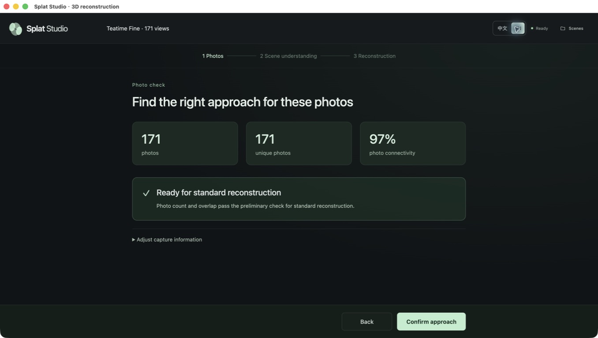

中文界面截图 / Chinese interface

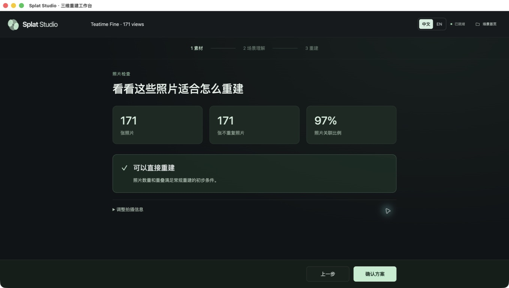

### 03. Tell the system what deserves more detail / 告诉系统哪些物品更重要

This run prioritizes stuffed bear and coffee mug. Actual detected regions are reviewed before the approved masks drive weighted optimization and refinement.

本次输入 stuffed bear 与 coffee mug。后续审核实际检测区域，确认后的掩码参与重点加权与细化训练。

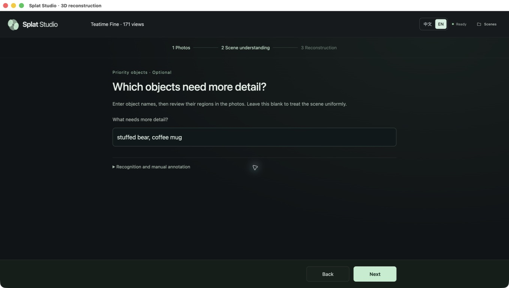

中文界面截图 / Chinese interface

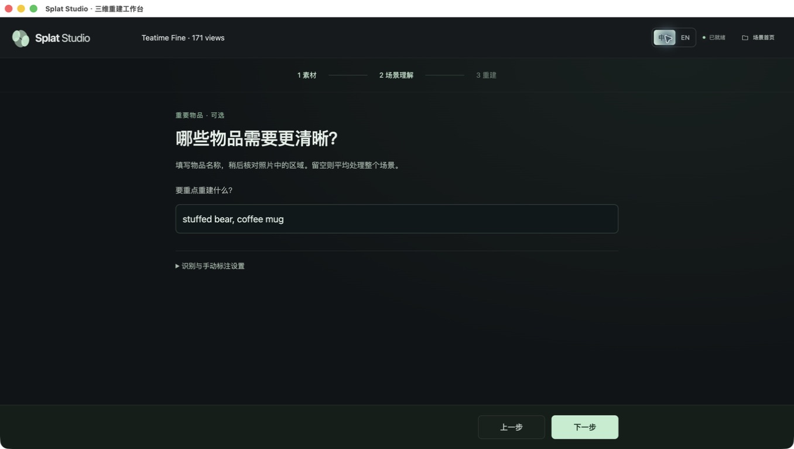

### 04. Fine mode on a cloud A100 / 精细模式与云端 A100

Both experiments use Fine mode: 22,000 RGB steps with all valid training views included in semantic optimization. The App estimates time from the device and selected budget.

两组实验均选择精细模式：22,000 步 RGB 训练，全部有效训练视角参与语义优化。App 根据设备与预算显示预计时间。

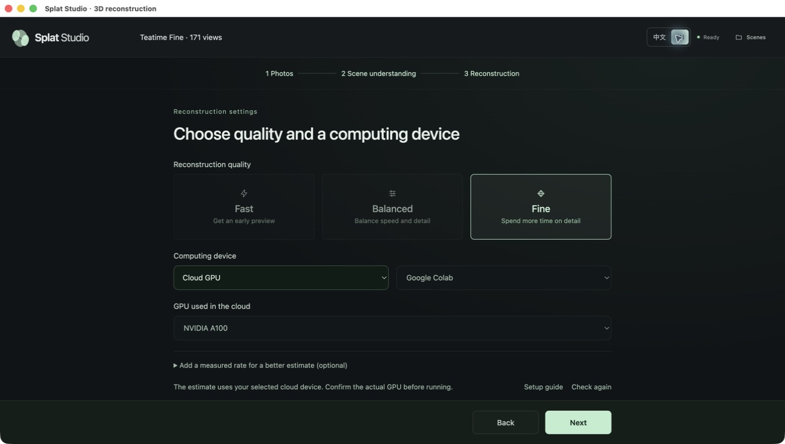

中文界面截图 / Chinese interface

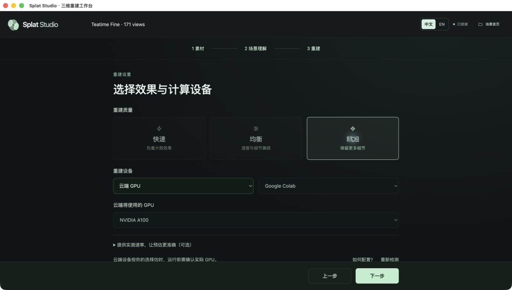

### 05. Review and confirm priority regions / 审核并确认重点区域

Inspect candidate masks and border warnings before approval. The English capture shows review; the full task subsequently confirms 252 image regions for training.

逐张核对识别区域，剔除误认和重复候选，再将确认结果加入训练。中文截图显示本次完整任务已确认 252 个照片区域。

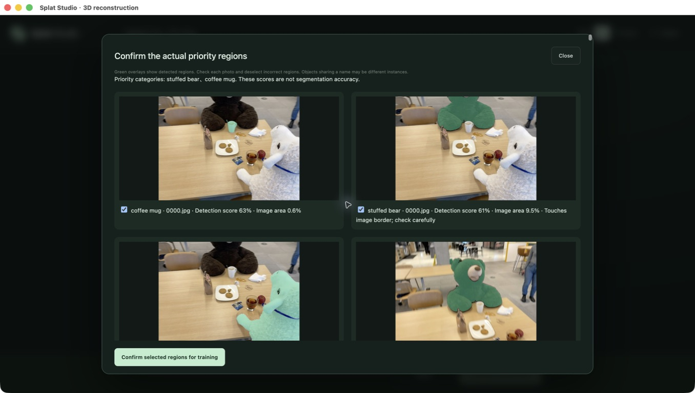

中文界面截图 / Chinese interface

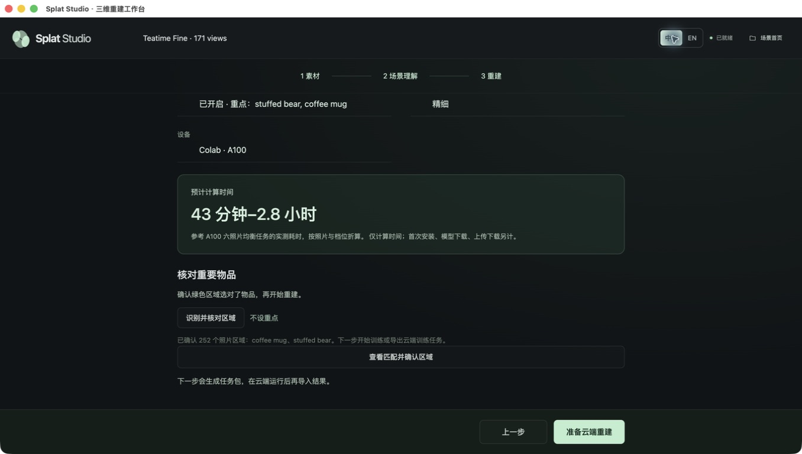

### 06. Six photos trigger the sparse route / 六张照片，触发稀疏策略

Low photo connectivity prompts sparse reconstruction with completion as needed. This run actually uses learned geometric initialization, cross-view depth constraints and 3DGS optimization.

照片连通性较低时，App 才建议稀疏重建与按需补全。本次训练实际使用学习几何初始化、跨视角深度约束与 3DGS 优化。

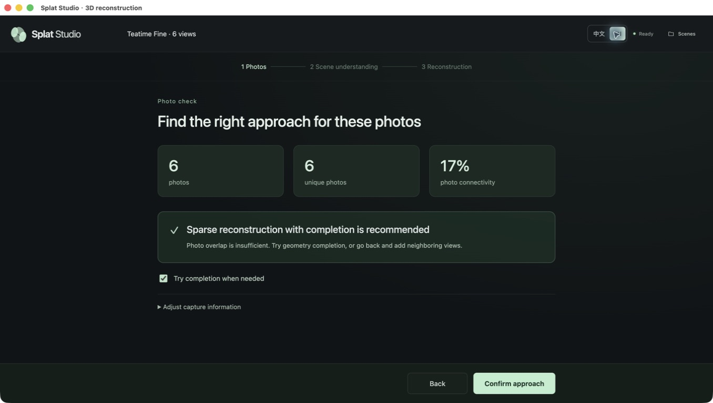

中文界面截图 / Chinese interface

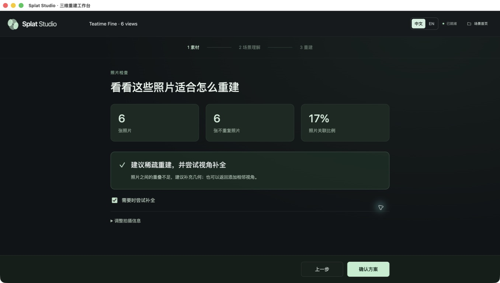

### 07. Import an existing scene / 导入已有场景

Choose appearance only or a scene with semantics. Semantic scenes support object search, focus and hiding.

选择仅外观或包含语义的场景。包含语义时，可以继续查找、定位和隐藏物品。

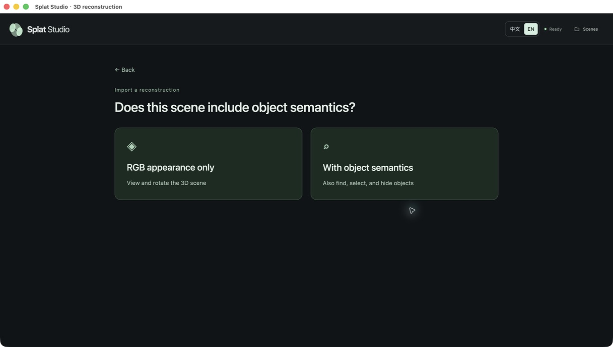

中文界面截图 / Chinese interface

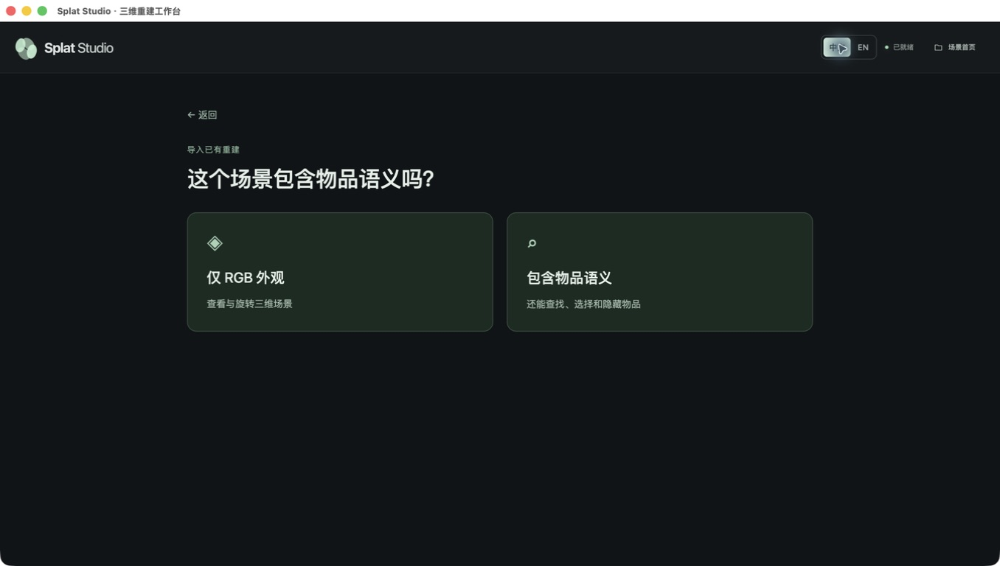

### 08. One file restores the complete scene / 一个文件，恢复完整场景

Import the trained JSONL, including Gaussians, degree-three SH, semantics and hierarchy. A separate semantic package is unnecessary.

导入已经完成训练的完整 JSONL。它包含高斯、三阶球谐系数、语义与层级，无需再选择独立语义包。

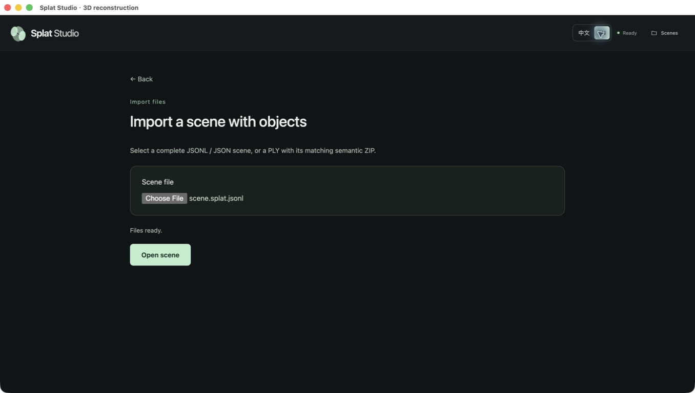

中文界面截图 / Chinese interface

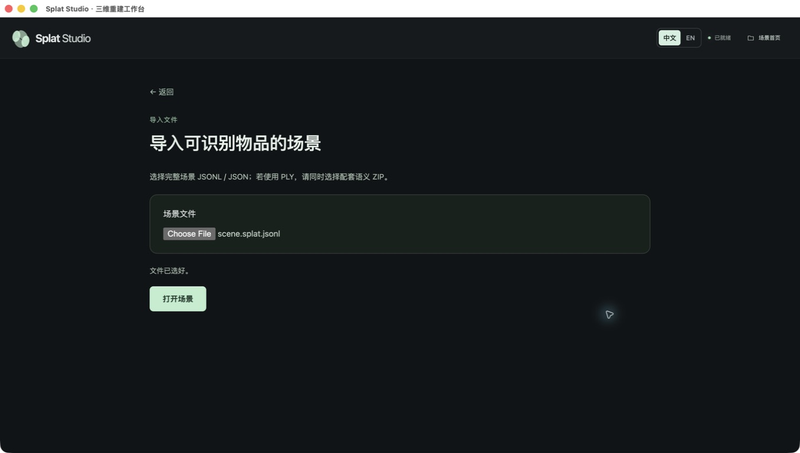

### 09. Explore the Fine reconstruction in the native App / 精细重建，在原生 App 中浏览

171 photos and 22,000 training steps produce 2,162,260 Gaussians, all loaded with degree-three SH. This view enables core-region visibility while retaining the complete model.

171 张照片、22,000 步训练，完整载入 2,162,260 个高斯及三阶球谐系数。本画面启用核心区域显示；模型数据保持完整。

中文界面截图 / Chinese interface

### 10. Inspect the executed priority refinement / 查看重点细化的实际过程

The bear and coffee mug receive 2,400 refinement steps within the total budget, adding 16,000 Gaussians. Comparisons use the same training cameras; all three results, including local error increases, are retained and are not a matched ablation.

熊与咖啡杯使用总预算内最后 2,400 步细化，新增 16,000 个高斯。对照来自相同训练相机，三组结果及局部误差上升均保留，不将其作为独立消融增益。

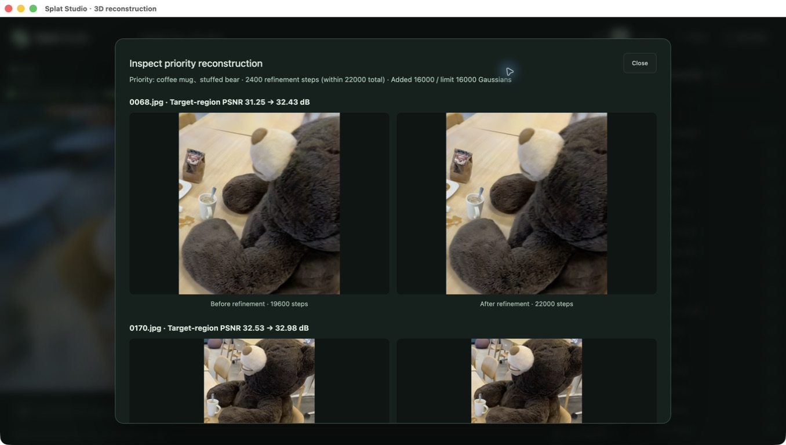

中文界面截图 / Chinese interface

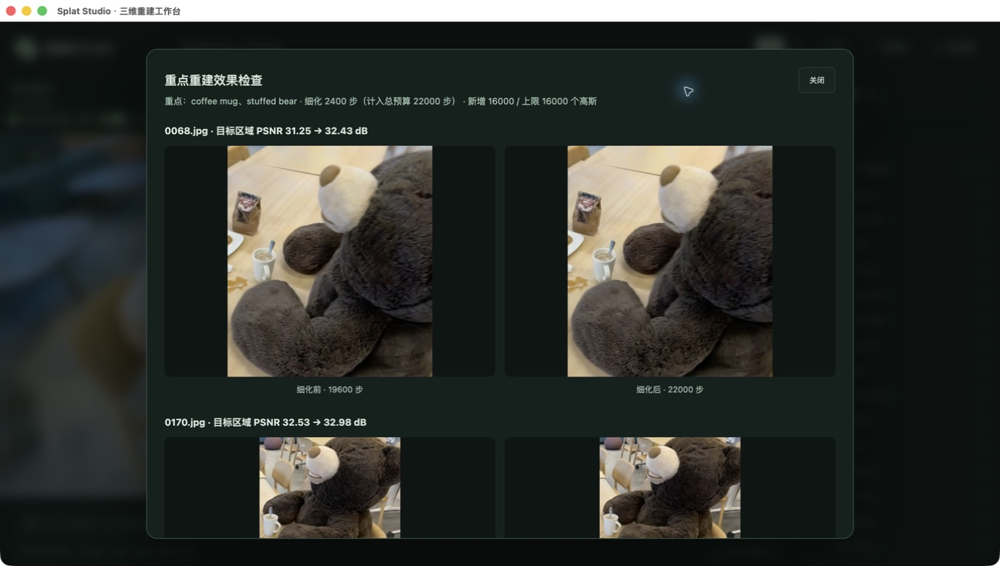

### 11. Find an object and inspect cross-view confidence / 查找物品，核对跨视角可信度

Search for the bear and select a region with a parts hierarchy. The panel reports 127,470 Gaussians and 54% cross-view confidence for that region; confidence is distinct from segmentation IoU.

通过名称查找小熊，再选中具有部件层级的区域。面板显示该区域的 127,470 个高斯和 54% 跨视角可信度；此可信度不是分割 IoU。

中文界面截图 / Chinese interface

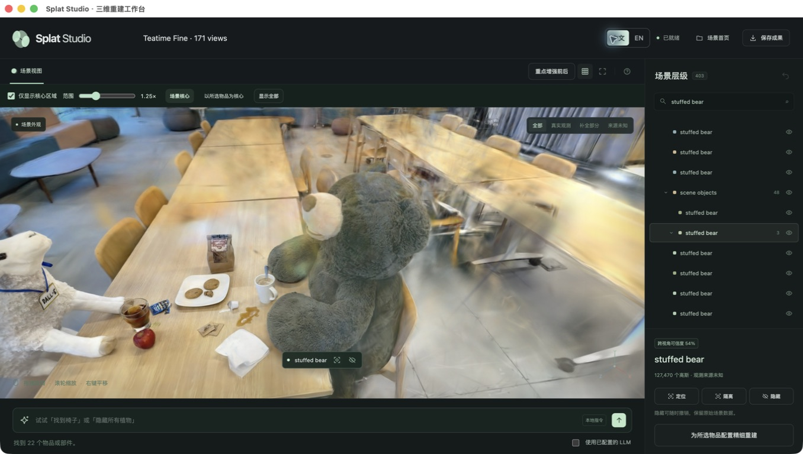

### 12. Isolate an object to inspect its 3D region / 隔离物品，检查局部三维区域

Show the selected bear region and its hierarchy descendants to inspect the reconstructed shape. Residual prediction noise remains visible; hiding other objects does not delete source data.

只显示选中的小熊区域及其层级后代，便于检查重建形状。画面保留真实预测中的残余噪声；隐藏其他物品不会删除原始数据。

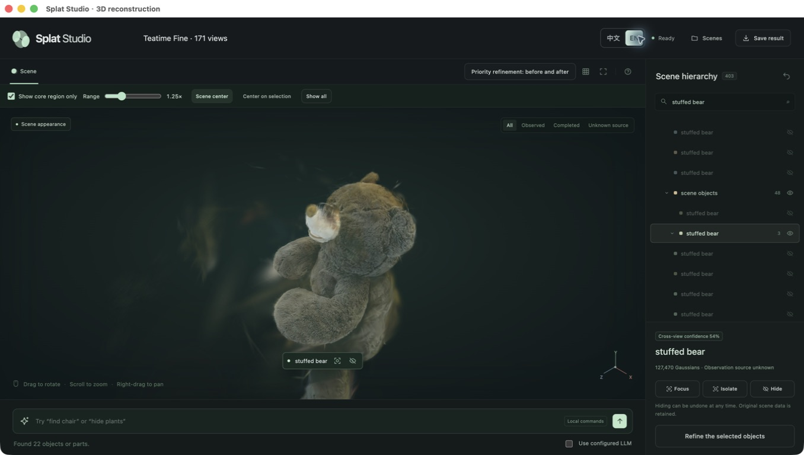

中文界面截图 / Chinese interface

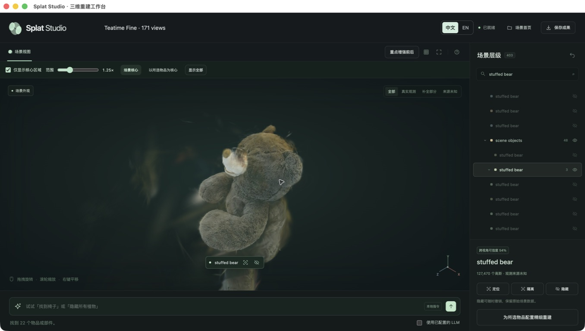

### 13. Undo restores the scene / 一句撤销，恢复场景

The undo command restores the scene after isolation. Visibility is restored without retraining or reimporting the model.

执行 undo 后，刚才隔离的场景重新完整显示。撤销恢复显示状态，不需要重新训练或重新导入。

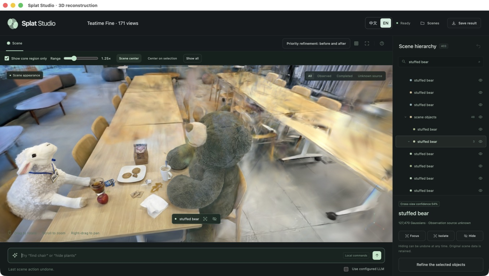

中文界面截图 / Chinese interface

### 14. Hide matching semantic regions / 按语义区域隐藏物品

The hide stuffed bear command hides matching bear regions. Residual parts and occlusions remain as measured: this is reversible visibility editing and does not synthesize background hidden behind the object.

用 hide stuffed bear 隐藏匹配的小熊语义区域。截图保留真实的残余部件与遮挡区域，展示的是可撤销的可见性编辑；不会生成被物体遮挡的背景。

中文界面截图 / Chinese interface

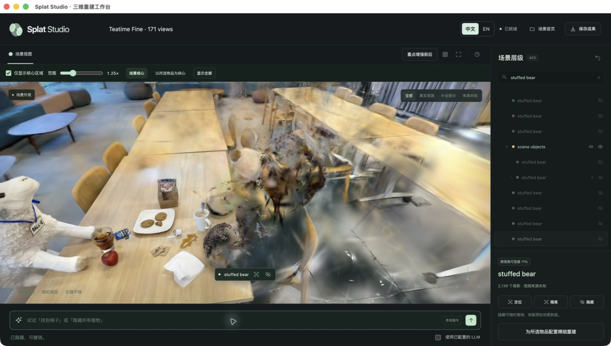

### 15. The actual six-view reconstruction / 六视角的实际重建成果

Six training photographs, conditional visible-geometry completion and 22,000 training steps. All 84,748 Gaussians and degree-three SH load in the App; sparse-input edge artifacts remain visible.

仅用六张训练照片，按需补全可见几何后完成 22,000 步训练。全部 84,748 个高斯及三阶球谐载入 App；画面保留稀疏输入产生的边缘残余。

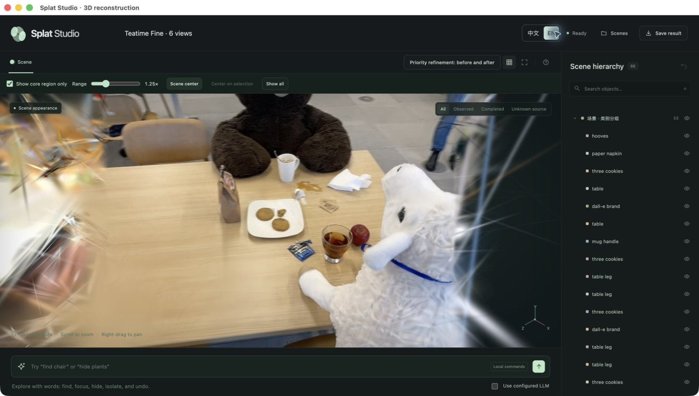

中文界面截图 / Chinese interface

### 16. Priority refinement also runs with sparse input / 稀疏输入也执行重点细化

The six-view task executes 2,400 final refinement steps within its total budget, adding 16,000 Gaussians. The panel retains three same-camera training comparisons; held-out quality is reported separately in Measurements.

六视角任务在总预算内执行最后 2,400 步重点细化，新增 16,000 个高斯。面板提供三组同相机的训练前后对照；独立测试视角指标另列于精度评测。

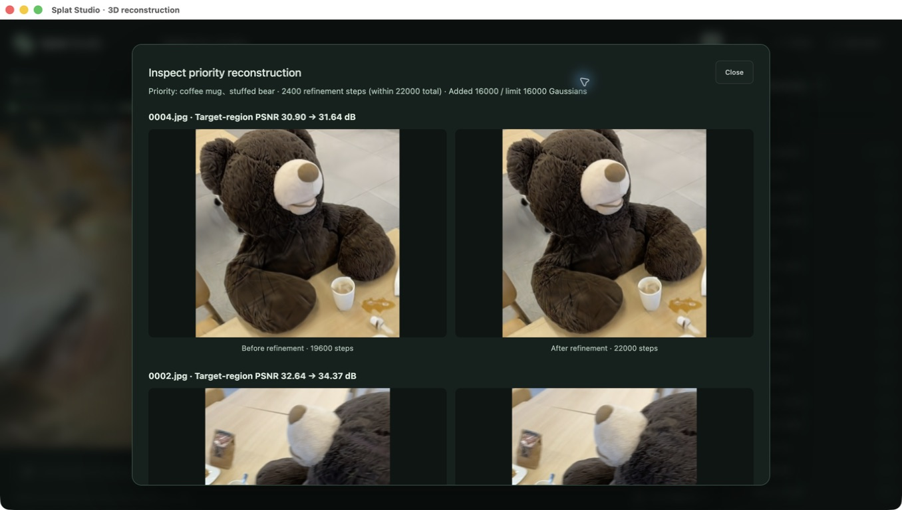

中文界面截图 / Chinese interface

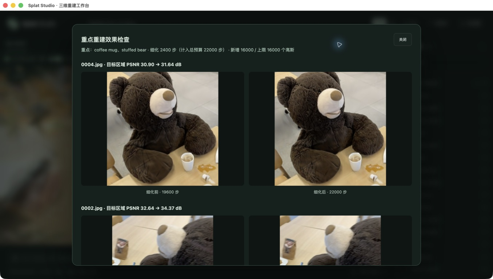

### 17. Save the complete result under its scene name / 用场景名称保存完整成果

The native Save dialog exports Teatime Fine · 6 views.splat.jsonl, containing Gaussians, SH, semantics, hierarchy and core-region visibility settings for reimport.

实际通过原生保存窗口导出 Teatime Fine · 6 views.splat.jsonl。文件包含高斯、球谐、语义、层级与核心区域显示设置，可再次导入。

中文界面截图 / Chinese interface

### 18. Reopen the saved result and keep exploring / 保存后再次打开，继续操作

The exported file is reimported in the native App. All 84,748 Gaussians preserve geometry, appearance, SH and semantic fields; hierarchy and core-region visibility settings are restored.

已将刚导出的文件重新导入原生 App。逐项核对全部 84,748 个高斯，几何、颜色、球谐与语义字段保持一致；层级和核心区域显示设置恢复。

中文界面截图 / Chinese interface

## Data attribution / 数据署名

Teatime photographs and human annotations are from the expanded LERF data distributed by [LangSplat](https://github.com/minghanqin/LangSplat#datasets). 本展示的 Teatime 原图与人工语义标注来自 LangSplat 提供的扩展 LERF 数据。Comparison figures retain this attribution; complete datasets and model weights are excluded from this showcase. [Method references / 方法来源](方法与实测说明.md).
